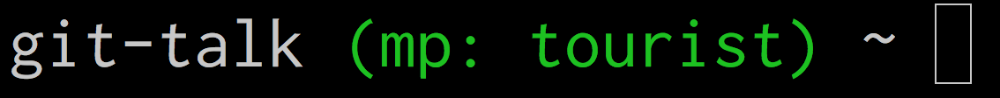
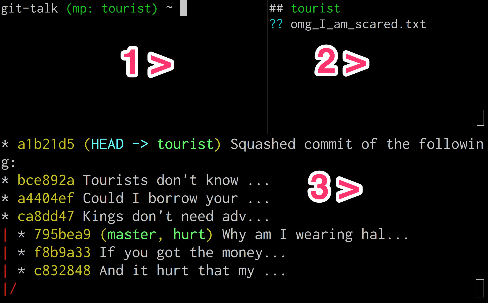
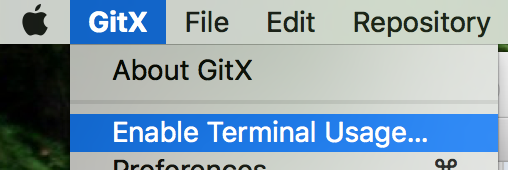

# Git Jungle Guided Tours Notes
This repo provides the slides, environment, and setup information from the [Git Jungle Guided Tours talk (video here)](https://www.youtube.com/watch?v=M0lxvBFMFwg) given at Stir Trek 2018.

If you have any questions, please feel free to add it to [Issues](https://github.com/marcpeabody/git-jungle-guided-tours/issues).

# The Song
[Chords to the original "Five Foot Two"](http://www.doctoruke.com/fivefoottwocomb.pdf)

Lyrics to "Has Anybody Seen My Code":

```
Checked my branch; popped my stash.
Still don't know where it is at.
Has anybody seen my code?

How'd I get this detached HEAD?
Don't git blame me I'm innocent!
Has anybody seen my code?

So if you run into a beautiful commit
That's code complete with a testing suite
Betcha life that isn't it!

But that's OK - it's a WIP
And now it's never gonna ship.
Has anybody seen
Has anybody seen
Has anybody seen my code?
```

# Git Prompt
I mentioned the importance of feedback. A command line prompt that at least shows your branch name is really helpful.


Here is my setup for a prompt. It's maybe only slightly modified (if at all) from the old [Edgecase Pairing Config](https://github.com/edgecase/pairing-config)

```
function set_prompt() {
  export PS1='%2/ ~ '

  branch_name=$(git_branch_name)
  author_name=$(git_author_name)
  if [ -n "$branch_name" ]; then
    export PS1='%1~%{$reset_color$bold_color$fg[green]%}%{$reset_color$fg[green]%} ($author_name: $branch_name)%{$reset_color%} ~ '
  fi
}

function git_branch_name() {
  git branch 2> /dev/null | sed -e '/^[^*]/d' -e 's/* \(.*\)/\1/'
}

function git_author_name() {
  git config --get user.name | sed 's/\([a-zA-Z+]\)[a-zA-Z]* */\1/g' | tr '[A-Z]' '[a-z]'
}
```

# My Git Config
My base config that includes things like colors you can also find in the [Edgecase Pairing Config](https://github.com/edgecase/pairing-config).

I really like using some of those git aliases like co for checkout but avoided them during the talk because it could be disorienting to those who have never seen aliases used.

Some helpful configs:

This one was mentioned during the talk. It automatically deletes the remote branches on your local machine that have been deleted from the central repo. This deletion happens when you git fetch all the time!

```
git config --global fetch.prune true
```

This one makes pushing a new branch slightly more convenient than the usual push.default of "simple". If I remember correctly, this allows me to just "git push" a brand new branch and it will automatically create a new remote branch of the same name.

```
git config --global push.default current
```

This rerere config helps you to not have to resolve the same merge conflict twice. It will remember your choices from the first time

```
git config --global rerere.enabled true
```

# Terminal
I used [iTerm2](https://www.iterm2.com/). You can split panes with Cmd+Opt+Shift+(V for vertical or H for horizontal).

# Extra Software
I used homebrew to brew install watch and pigz, which are not available commands on a Mac. Other commands like diff and od I believe came installed on my Mac.

# Extra Aliases and Functions
The rando_commit function pulls a random line from the [jungle.txt](resources/jungle.txt) file and appends it to a file in your current directory called rando.txt.

It then adds the file and makes a commit, using the random line in the commit message.

This made demoing way easier because you didn't have to watch me do all this by hand over and over.

I recommend using a function like this to play around with git commits. Use it to quickly build out a branch scenario, play around with merges and rebases, or just practice recovering "lost" commits like we did in the demos.
```
function rando_commit {
  set -A times "${1:-1}"

  echo $times
  repeat $times {
    RAND=$RANDOM
    LINE=$(head -$(($RAND % `wc -l < ~/.zsh/jungle.txt` + 1)) ~/.zsh/jungle.txt | tail -1)
    echo $LINE >> rando.txt
    git add rando.txt
    git commit -m "${LINE:0:20}...

${LINE:20}"
  }
}
```

Here are some other zsh/bash aliases 

```
# I like making an alias for every project I work on
alias gt="cd ~/projects/fun/git-talk/"

# watch: -t is no header
#        -n 1 is refresh every second
#        --color accepts color info
alias xstat="watch -t -n 1 --color git -c color.status=always status -sb"

# Look at the .git/ internals
# but ignore some parts to make it less noisy
alias xtree="watch --color -tn 1 tree -Ca --charset=ascii -I \"hooks\|logs\|config\|COMMIT_EDITMSG\" .git/"

# git log constantly refreshed
# usually ran this in panel 3 (bottom panel)
alias xlog="watch -tn 1 --color git log --color=always --oneline --graph --decorate --abbrev-commit --all"

# I don't think I used this one
# but we did look at reflogs without it
# Note: this does not specify which ref to use
# so it default to HEAD. (branches are also refs)
alias xref="watch -tn 1 --color git reflog --color=always"

# We used this early on to get a prettier layout of the git objects (instead of xtree)
alias xobj='watch -tn 1 --color "git cat-file --batch-check=\"%(objectname) %(objecttype)\" --batch-all-objects"'

# sometimes viewing binary content (i.e. cat .git/objects/ff/12341234...)
# will bork the prompt. This magic will probably fix it.
alias xwut='echo -e "\033c"'
```

# Demos
Here are the scripts I followed. I identified which panel the code went into with "1 >" notations.



## Demo 1: Git Objects
```
2 > (empty)
3 > watch find .

1 > (build out the working tree from slide)
1 > git init

2 > xstat
3 > xtree

1 > cat .git/HEAD (unborn master)
1 > git add welcome.txt
3 > (new SHA for blob git object)

1 > cat .git/objects/4e/ff... 
1 > cat .git/objects/4e/ff... | pigz -d

1 > git cat-file -t
1 > git cat-file -s
1 > git cat-file -p

1 > git add guides/
1 > git cat-file -p (SHAs)

3 > xobj
1 > git commit -m "jungle tour welcome"
1 > git cat-file -p (commit SHA)
1 > git cat-file -p (tree SHAs)

1 > cat .git/index
1 > git ls-files -s
```
## Demo 2: Duplicate Contents
```
1 > cp -r guides/ animals/
1 > git add guides/

3 > (no change!)

1 > git commit -m "guides are animals"
3 > (only 1 new tree and 1 new commit!)

1 > git cat-file -p (commit SHA)
1 > git cat-file -p (tree SHA 1879)
```

## Demo 3: Dangling Objects pt. 1
```
3 > xobj
1 > echo "bananas" > yummy.txt
1 > git add yummy.txt
1 > git cat-file -p 9baf

1 > echo "grass" >> yummy.txt
1 > git add yummy.txt
1 > git cat-file -p c13c

3 > (still has 9baf!)

1 > git fsck
1 > git fsck --lost-found
1 > tree .git/lost-found
```

## Demo 4: Dangling Objects pt. 2
```
(wipe .git and all project files - be super careful!)
1 > git init
3 > xlog

1 > rando_commit 3
3 > (copy HEAD SHA)

1 > git commit --amend (:wq enter to keep same message)
3 > (the SHA changed!?)

1 > diff <(git cat-file -p <oldsha>) <(git cat-file -p <newsha>)

1 > git reflog master (or HEAD)
1 > git reset --hard HEAD@{1}
```

## Demo 5: Committed to Wrong Branch
```
1 > rando_commit
1 > git branch feature-branch
1 > git reset --hard master^
1 > git checkout feature-branch
```

## Demo 6: Accidentally Deleted Branch

Delete with: git branch -d the-branch

Note that it gives you the commit SHA the branch ref was pointed to when you deleted the branch ref. But you might lose that by the time you realize you needed that branch! Yikes!

Show that the reflog for the branch is also now gone. Sad.

I forgot to mention during the talk that a great way to record the branch ref SHA is to do this before you delete the branch:
```
git checkout branch-to-delete
git checkout -
```

Every basic checkout command typically moves just the HEAD pointer to a new branch ref (or directly to a commit SHA when detached). Every time HEAD moves it makes another entry in HEAD's reflog. This trick makes it so you will have the branch-to-delete position in a recent step of your HEAD reflog!

Oh, and the "git checkout -" is an awesome trick to checkout the previous thing that was checked out. It's super useful for toggling between two branches! I forgot to show this in the talk. :(

## Demo 7: Merge and Rebase
For merges, I wanted to show what Fast-Forwarding is and how it's what a git merge wants to do by default when it can. Also, what it does in that case it just move the branch pointer up to meet the other branch pointer. It's the same as git reset --hard in that case.

Also wanted to show with cat-file -p in a "normal" merge how the commit contains more than one parent.

We had to skip rebase because of time constraints. My main point I wanted to stress here is that the rebased commits are all copies of the originals, but the originals still exist, too. So you could just undo a rebase by locating the lost commit(s) and pointing your branch ref back to the old commit SHA.


# Other Stuff I Forgot
I really like the [rowanj's Gitx](https://rowanj.github.io/gitx/) for when I want something a little more visual than the command line. When you first open it, click on Enabled Terminal Usage from the menu:


This option will allow you to type "gitx" from your project's directory in the command line to open Gitx from the context of your project. You can even use the command line to pipe diffs to gitx or any other difftool like so:

```
git diff HEAD..HEAD~1 | gitx
```

I tend to use it as a diff tool to review my changes before I commit. This helps me make sure I don't let icky things like "debugger;" accidentally slip in.

Some folks prefer doing this kind of review with git add -p in the command line. That's ok too. Just be aware that this ignores untracked files (git commit -am ignores them too!).

There's a nifty trick for getting around that: git add -N which means "intent to add" - it's kind of like telling git to add/track an empty version of the untracked files. This tricks some git commands into doing what you probably wished they would have done with untracked files in the first place.

Oh, but the -N trick actually breaks git stash. And git stash is one of those silly commands that doesn't by default work well with untracked files. Just always do git stash -u to make it grab untracked files.
